# 🏗️ Architecture Overview

## System Architecture

```mermaid
graph TB
    subgraph "Developer Workflow"
        DEV[👨‍💻 Developer]
        DEV --> |git push| REPO[📁 GitHub Repository]
    end
    
    subgraph "CI/CD Pipeline"
        REPO --> |webhook| GHA[⚙️ GitHub Actions]
        GHA --> |on success| BUILD{🔨 Build & Test}
        GHA --> |on failure| LOGS[📋 Collect Logs]
    end
    
    subgraph "AWS Infrastructure"
        LOGS --> |upload| S3[🗄️ S3 Bucket<br/>Log Storage]
        S3 --> |trigger| LAMBDA[🤖 Lambda Function<br/>AI Analyzer]
        
        LAMBDA --> |analyze| LLM[🧠 LLM Provider<br/>Groq/OpenAI/HF]
        LAMBDA --> |create PR/Issue| GHAPI[🐙 GitHub API]
        LAMBDA --> |send email| SES[📧 Amazon SES]
        
        BUILD --> |on success| ECR[📦 Amazon ECR<br/>Container Registry]
        ECR --> |deploy| ECS[🚀 ECS Fargate<br/>Application Hosting]
        
        subgraph "Monitoring"
            CW[📊 CloudWatch<br/>Logs & Metrics]
            LAMBDA --> CW
            ECS --> CW
        end
    end
    
    subgraph "Notifications"
        GHAPI --> |creates| PR[🔀 Pull Request<br/>with fixes]
        SES --> |delivers| EMAIL[📧 Email Notification]
    end
    
    style LAMBDA fill:#ff9999,stroke:#333,stroke-width:2px
    style LLM fill:#99ccff,stroke:#333,stroke-width:2px
    style GHAPI fill:#99ff99,stroke:#333,stroke-width:2px
    style PR fill:#ffcc99,stroke:#333,stroke-width:2px
```



## Component Breakdown

### 🔄 CI/CD Pipeline Flow

1. **Code Push**: Developer pushes code to GitHub repository
2. **GitHub Actions**: Workflow triggers automatically
3. **Testing**: Runs automated tests on the application
4. **Log Collection**: Captures all output, errors, and context

### 🤖 Self-Healing Process (On Failure)

1. **Log Upload**: CI logs uploaded to S3 bucket
2. **AI Invocation**: Lambda function triggered with failure context
3. **Log Analysis**: AI retrieves and analyzes the failure logs
4. **Root Cause Analysis**: LLM identifies the problem and solution
5. **Fix Generation**: Creates specific, actionable fix instructions
6. **PR/Issue Creation**: Automatically opens GitHub PR or Issue
7. **Notification**: Sends detailed email with analysis and links

### 🚀 Deployment Process (On Success)

1. **Docker Build**: Creates containerized application
2. **ECR Push**: Uploads image to Amazon ECR
3. **ECS Deployment**: Updates Fargate service with new image
4. **Health Checks**: Verifies application is running correctly

## AWS Resource Map

```
┌─────────────────────────────────────────────────────────────┐
│                        AWS Account                          │
├─────────────────────────────────────────────────────────────┤
│  📦 S3 Bucket (Logs)                                       │
│  ├── logs/                                                 │
│  │   ├── 123456789.txt                                    │
│  │   └── 123456790.txt                                    │
│  └── analysis/                                             │
│      ├── 123456789.json                                   │
│      └── 123456790.json                                   │
├─────────────────────────────────────────────────────────────┤
│  🤖 Lambda Function                                        │
│  ├── Runtime: Python 3.11                                 │
│  ├── Memory: 256MB                                         │
│  ├── Timeout: 30s                                          │
│  └── Environment Variables:                                │
│      ├── PROVIDER=groq                                     │
│      ├── LLM_API_KEY=***                                   │
│      └── GITHUB_TOKEN=***                                  │
├─────────────────────────────────────────────────────────────┤
│  📦 ECR Repository                                          │
│  ├── self-healing-ci-app                                   │
│  └── Image Tags: latest, SHA-abc123                        │
├─────────────────────────────────────────────────────────────┤
│  🚀 ECS Cluster                                             │
│  ├── Cluster: self-healing-ci-cluster                      │
│  ├── Service: self-healing-ci-app-service                  │
│  ├── Task Definition: 256 CPU, 512 MB Memory               │
│  └── Launch Type: Fargate                                  │
├─────────────────────────────────────────────────────────────┤
│  📧 SES Configuration                                       │
│  ├── Verified Identities                                   │
│  ├── Configuration Set                                      │
│  └── CloudWatch Integration                                │
├─────────────────────────────────────────────────────────────┤
│  📊 CloudWatch                                              │
│  ├── Log Groups:                                           │
│  │   ├── /aws/lambda/self-healing-ci-ai-analyzer          │
│  │   └── /ecs/self-healing-ci                             │
│  ├── Metrics & Alarms                                      │
│  └── Dashboard                                             │
└─────────────────────────────────────────────────────────────┘
```

## Security Architecture

### 🔐 IAM Roles & Policies

1. **Lambda Execution Role**:
   - S3 read/write access to logs bucket
   - SES send email permissions
   - CloudWatch logs access

2. **ECS Task Execution Role**:
   - ECR image pull permissions
   - CloudWatch logs access

3. **ECS Task Role**:
   - Minimal application runtime permissions

### 🛡️ Security Boundaries

- **Network**: ECS tasks in public subnets with security groups
- **API Access**: GitHub token with repository scope only
- **Storage**: S3 bucket with server-side encryption
- **Communication**: All API calls over HTTPS/TLS
- **Secrets**: Environment variables, no hardcoded credentials

## Scalability Considerations

### 📈 Current Scale (Free Tier Optimized)

- **Lambda**: 1M invocations/month (typical usage: ~100/month)
- **S3**: 5GB storage (logs auto-deleted after 30 days)
- **ECS**: Single task, 0.25 vCPU, 512MB memory
- **CloudWatch**: 5GB logs/month, 14-day retention

### 🚀 Production Scale Recommendations

- **Lambda**: Increase memory for faster LLM calls
- **ECS**: Auto-scaling based on CPU/memory metrics
- **S3**: Lifecycle policies for long-term log archival
- **Monitoring**: Enhanced CloudWatch dashboards and alerts

## Integration Points

### 🔌 External APIs

1. **GitHub API**: Repository management, PR/Issue creation
2. **LLM Providers**: 
   - Groq (default): Fast inference, competitive pricing
   - OpenAI: High-quality responses, higher cost
   - HuggingFace: Free tier available, variable quality
3. **AWS Services**: Native SDK integration

### 📡 Webhooks & Events

- GitHub Actions triggers Lambda via AWS CLI
- S3 events could trigger additional processing
- CloudWatch alarms for operational monitoring

## Cost Optimization

### 💰 Free Tier Usage

| Service | Free Tier | Expected Usage | Estimated Cost |
|---------|-----------|----------------|----------------|
| Lambda | 1M requests | 100/month | $0.00 |
| S3 | 5GB storage | <1GB | $0.00 |
| ECS | 20GB-hours | ~15GB-hours | $0.00 |
| ECR | 500MB storage | <100MB | $0.00 |
| SES | 200 emails (from EC2) | 50/month | $0.05 |
| CloudWatch | 5GB logs | 2GB | $0.00 |
| **Total** | | | **~$0.05/month** |

### 📊 Scaling Costs

Beyond free tier, costs scale linearly:
- Lambda: $0.20 per 1M requests
- S3: $0.023 per GB/month
- ECS: $0.04048 per vCPU hour
- ECR: $0.10 per GB/month
